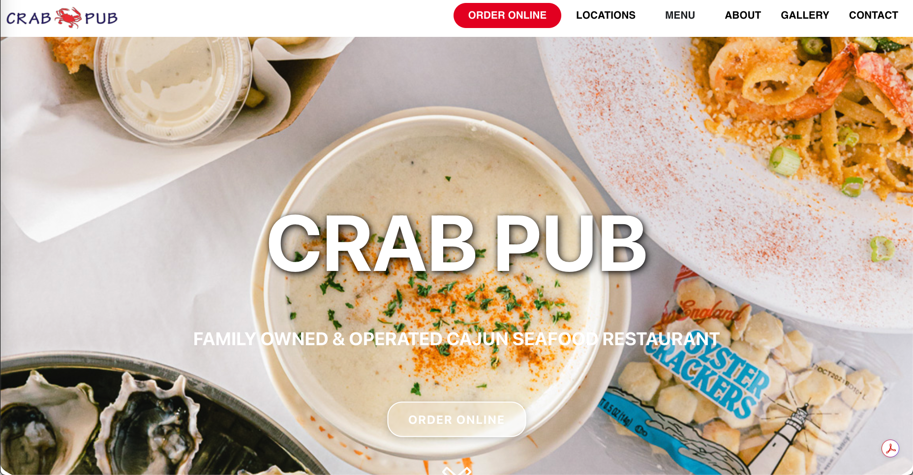
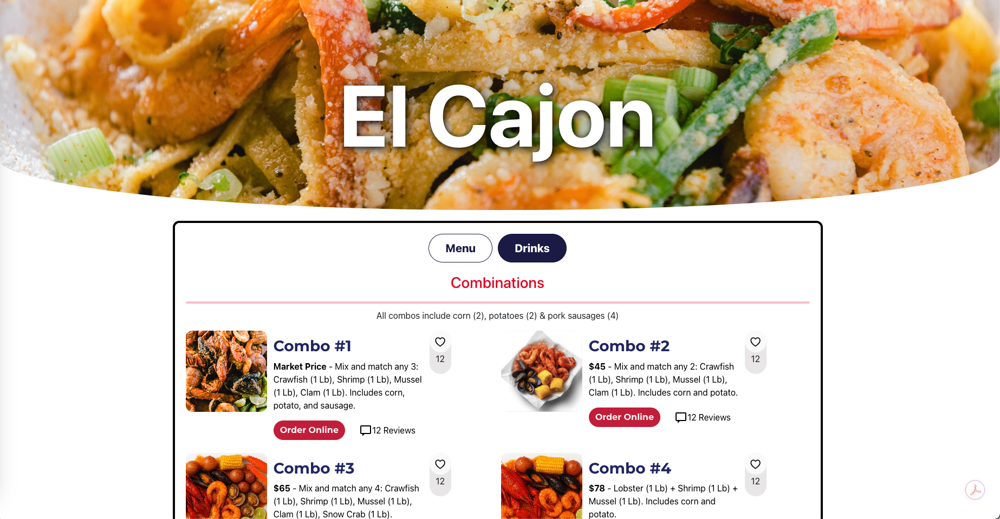
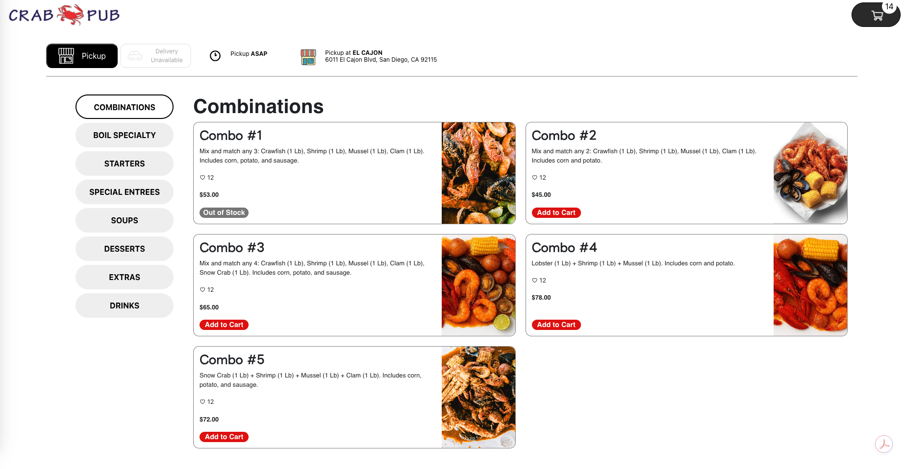
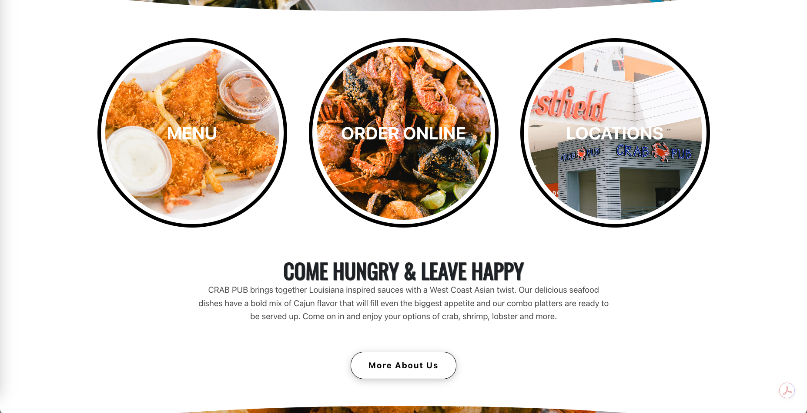
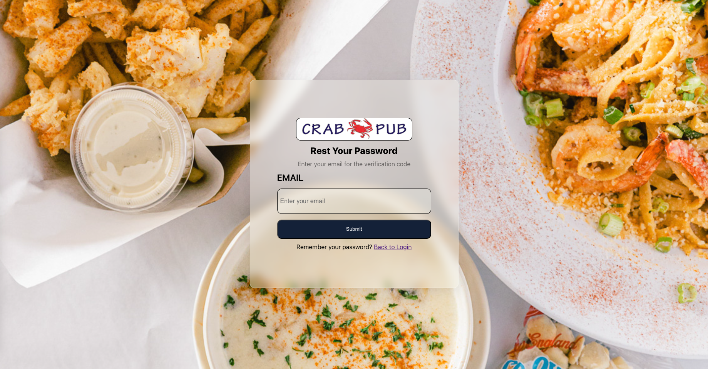
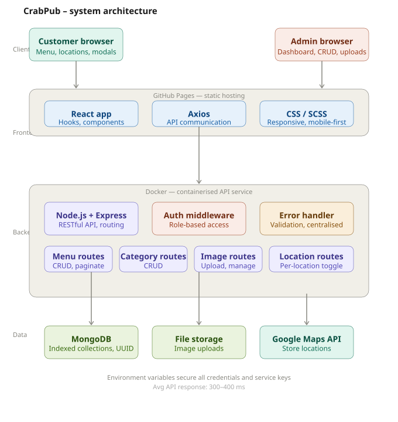

# Hi 👋, I'm Hung Pham

### 🚀 Full Stack Developer

I’m a full-stack developer passionate about building **scalable, user-focused web applications** and continuously improving my system design and backend architecture skills.

---

### 👨‍💻 About Me

- 🔭 Currently building an **end-to-end MERN stack restaurant website** (frontend, backend, database)
- 🌱 Actively improving my skills in **MongoDB, backend architecture, and full-stack system design**
- 👯 Open to collaborating on **open-source and real-world full-stack projects**
- 🤝 Looking for mentorship and guidance in **system design and scalable architectures**
- 💬 Ask me about **React, Node.js, REST APIs, and building maintainable full-stack applications**
- ⚡ Fun fact: I speak **English and Vietnamese**

---

---
### 💼 Projects

  
<strong>🦀 CrabPub – Restaurant Management System (Click to expand)</strong>https://github.com/HungPhma/Crab-Pub.git

   

  CrabPub is a **production-ready full-stack web application** built for a local seafood restaurant chain with multiple locations. The system streamlines digital menu management, supports location-based availability, and provides a secure admin dashboard for real-world restaurant operations.

---

## 🚀 Live Project Overview

- **Type:** Full-Stack Web Application  
- **Status:** Live & actively maintained  
- **Client:** Local seafood restaurant chain (3 locations)  
- **Purpose:** Online menu, admin management, and scalable restaurant operations  

---

 
## 📸 Screenshots
 
### Customer page
 
> Browse the menu, view combos, and find your nearest location.

---
## 🏗 System Architecture

---

## ✨ Features

### Customer-Facing
- Browse menu by **categories and combo meals**
- Location-based item availability
- Responsive, mobile-first UI
- Google Maps integration for store locations
- Modal-based menu and ordering flow

### Admin Dashboard
- Secure admin authentication
- Full **CRUD** for menu items and categories
- Image upload and management
- Toggle item availability per location
- Pagination and optimized queries for large menus

---

## 🛠 Tech Stack

### Frontend
- React (Hooks, component-based architecture)
- CSS / SCSS (responsive design)
- Axios for API communication

### Backend
- Node.js & Express
- RESTful API architecture
- MongoDB with indexed collections
- UUID-based document identifiers

### DevOps & Deployment
- Dockerized services
- Frontend hosted on static hosting (GitHub Pages)
- Backend deployed as API service
- Environment variables for secure configuration

---

## 🔐 Security & Performance

- Role-based admin access
- Input validation and centralized error handling
- Indexed MongoDB queries for fast lookups
- Average API response time: **~300–400ms**

---

## 📈 Impact

- Used in a **real production environment**
- Reduced manual menu updates to near zero
- Improved customer ordering experience
- Scalable architecture ready for additional locations

---

## 🔮 Future Enhancements

- Online payment integration
- Order tracking and history
- Analytics dashboard for admins
- User accounts and loyalty system
- Admin role hierarchy (owner vs manager)

 
<strong>💅 Inails & Spa – Business Website & Management System (Click to expand)</strong>https://github.com/HungPhma/InailsAndSpa.git
  

End to end business website built for a local nail salon to modernize online presence and streamline service management.

 
<strong>📸 BotBotPhotography – Portfolio Website (Click to expand)</strong>https://github.com/HungPhma/botbot_project.git
  

Professional photography portfolio website built to showcase albums, manage galleries, and support client inquiries through a responsive modern interface.

Designed with performance, UI aesthetics, and real-world deployment in mind.

### 🌐 Portfolio & Resume
- 👨‍💻 Portfolio: **https://hpham.dev/**
- 📄 Resume: **https://drive.google.com/file/d/1ABro04SE66gxB2-QYUBJG18BCbhgI_wa/view**

---

### 📫 Contact
📧 **Hpham23.official@gmail.com**

---

### 🤝 Connect with Me

  
  
  

---

### 🛠 Languages & Tools

  

---

### 📊 GitHub Stats

  

---
### 🔥 GitHub Streak

  

⭐ *Thanks for visiting my GitHub profile — feel free to explore my repositories and reach out!*
