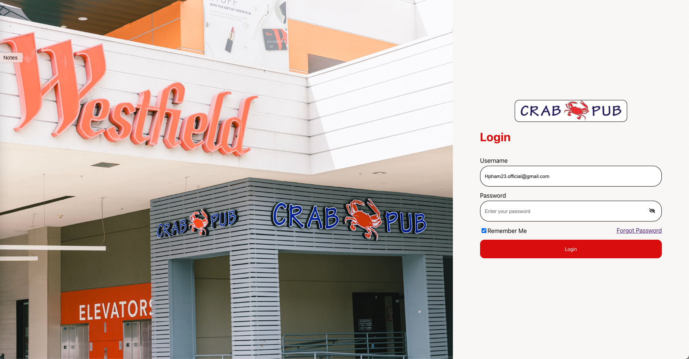

<div align="center">

```
██╗  ██╗██╗   ██╗███╗   ██╗ ██████╗     ██████╗ ██╗  ██╗ █████╗ ███╗   ███╗
██║  ██║██║   ██║████╗  ██║██╔════╝     ██╔══██╗██║  ██║██╔══██╗████╗ ████║
███████║██║   ██║██╔██╗ ██║██║  ███╗    ██████╔╝███████║███████║██╔████╔██║
██╔══██║██║   ██║██║╚██╗██║██║   ██║    ██╔═══╝ ██╔══██║██╔══██║██║╚██╔╝██║
██║  ██║╚██████╔╝██║ ╚████║╚██████╔╝    ██║     ██║  ██║██║  ██║██║ ╚═╝ ██║
╚═╝  ╚═╝ ╚═════╝ ╚═╝  ╚═══╝ ╚═════╝     ╚═╝     ╚═╝  ╚═╝╚═╝  ╚═╝╚═╝     ╚═╝
```

**Full Stack Developer** · MERN · REST APIs · Docker

[](https://hpham.dev/)
[](https://www.linkedin.com/in/hung-pham11/)
[](https://github.com/HungPhma)
[](https://leetcode.com/Hpham23)
[](https://drive.google.com/file/d/1ABro04SE66gxB2-QYUBJG18BCbhgI_wa/view)

</div>

---

## About

I build **scalable, user-focused web applications** end-to-end — from database schema to polished UI. Currently deepening expertise in **backend architecture, MongoDB**, and **system design**. I care about clean code, real-world impact, and shipping things that actually work in production.

🇺🇸 🇻🇳 &nbsp; English · Vietnamese &nbsp;|&nbsp; 📧 [Hpham23.official@gmail.com](mailto:Hpham23.official@gmail.com)

---

## Projects

### 🦀 CrabPub — Restaurant Management System
> Production-ready full-stack app for a local seafood chain across 3 locations

**Stack:** React · Node.js · Express · MongoDB · Docker

| Feature | Detail |
|---|---|
| Customer UI | Browse menu by category/combo, location-based availability, Google Maps integration |
| Admin Dashboard | Secure auth, full CRUD, image upload, per-location item toggling |
| Performance | ~300–400ms avg API response, indexed MongoDB queries |
| DevOps | Dockerized, GitHub Pages frontend, deployed API backend |

[](https://github.com/HungPhma/Crab-Pub)

<details>
<summary>📸 Screenshots</summary>
<br/>

| Landing | Menu | Online Order |
|:---:|:---:|:---:|
|  |  |  |

| Options | Admin Dashboard | Reset Password |
|:---:|:---:|:---:|
|  |  |  |

</details>

---

### 💅 Inails & Spa — Business Website
> End-to-end site for a local nail salon to modernize their online presence and service management

[](https://github.com/HungPhma/InailsAndSpa)

---

### 📸 BotBotPhotography — Portfolio Website
> Professional photography portfolio with album management, galleries, and client inquiry flow

[](https://github.com/HungPhma/botbot_project)

---

## Tech Stack

**Frontend**


**Backend**


**DevOps & Tools**


---

## GitHub Stats

<div align="center">


&nbsp;&nbsp;


</div>

---

<div align="center">
<sub>Open to collaborations, mentorship, and full-stack opportunities · Let's build something real.</sub>
</div>